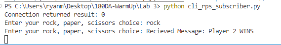
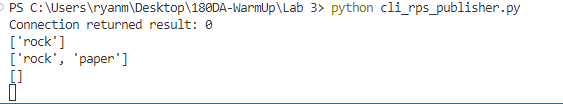
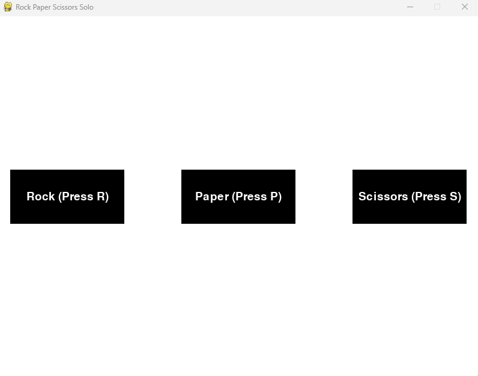
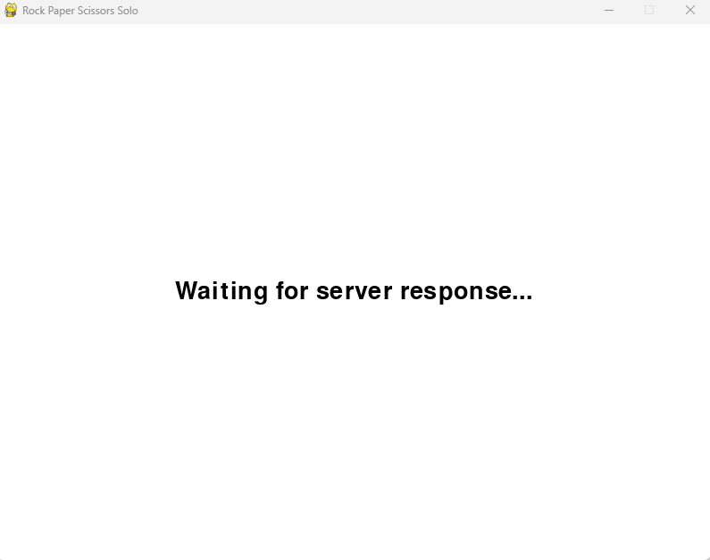
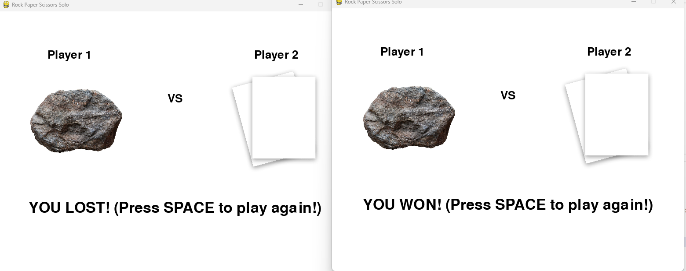

# 180DA Lab 3
1. 
    # CLI MQTT RPS
    Subscriber
    

    Publisher
    

    # GUI MQTT RPS
    Game Start from Subscriber View
    

    Waiting Screen Waiting for a Second Player
    

    Result After Return Message From Publisher
    

3. I think that for our project, I would want to implement the graphics in Unity because
our team was inspired by Fighters Uncaged on the Xbox 360 Kinect. While we are still debating
over whether we want a 3D or 2D game world, I am just generally interested in Unity development
in general and feel that it provides a lot of options.