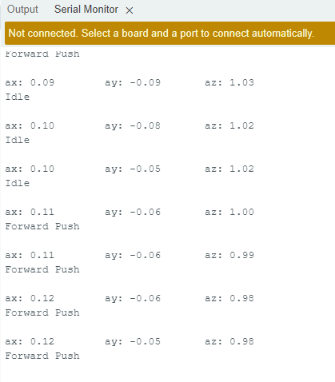

# 180DA-WarmUp-Lab-4

# Task 1
1. Working Microcontroller (Arduino Nano 33 IoT)

2. IMU Serial Printouts
        

# Task 2
1. Serial Monitor showcasing list of available networks

# Task 3
1. Recieving IMU data over MQTT 

2. The stream had a fair bit of lag when publishing data at an unrestrained frequency, however
by limiting the sending frequency through a timed interval, the lag was significantly reduced
to the point of being essentially negligible. If we only send messages when something is recognized,
then we can also significantly reduce lag. Another workaround for lag, givent that we need can not
decrease the message frequency, would be to limit the amount of data we are sending in our messages or
connect to a stronger network.

# Task 4
1. When the accelerometer is idle there is some gravitational acceleration as you can see some noise
generated in the outputs, even when the sensor is idle.

2. Generally when idle the accelerometer values for X are around -0.1 to 0.1 with respect to inital position.
The Y values hover around -0.1 to 0.1 as well and the Z values are around 0.9 to 1.1. Values drift even when idle,
thus instead of having a specific set of values correspond to the idle state, it could be best to have a threshold
correspond to idle.

3. In my classifier, I utilized accelerometer data to determine the motions of the two trivial actions
(forward push, upward lift) as the motions are most easily characterized by linear acceleration with
little change to orientation of the sensor. Structurally, my sketch essentially follows a decision tree
that first checks on threshold values for the idle state, then Z value (for upward lift), then X acceleration
(for forward push), to determine the classification of the user action.

4. To build a classifier with the 2 previous actions, idle, and a new circular motion would be significantly
more difficult to do with a simple decision tree. We can not use the same method as we did for the previous 2 features
because tracking a circular motion would require the program to keep track of previous motions states and use them
compartively against current IMU data to determine the path of motion. Additionally with our current IMU set up
(in my case I am using the Arduino Nano 33 IoT) there are issues with gyroscopic drift and noise that interfere furthermore.
An easier method to do this would be to train a neural network with instances of the circular motion so that it can effectively
recognize patterns in the IMU data of the action. Simply reading through the data, and having a human attempt to construct
the pattern would be an extremely arduous task.