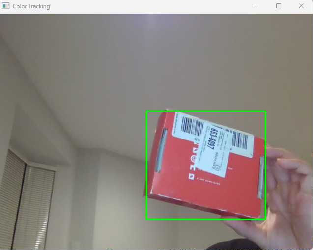
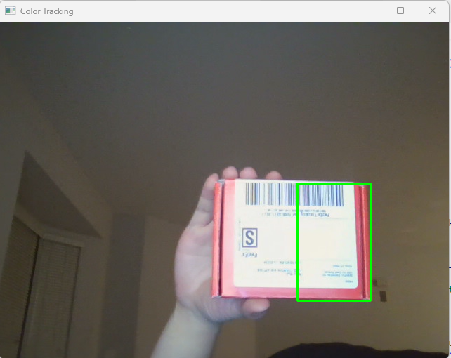
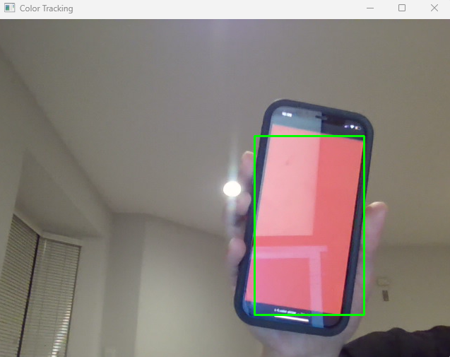
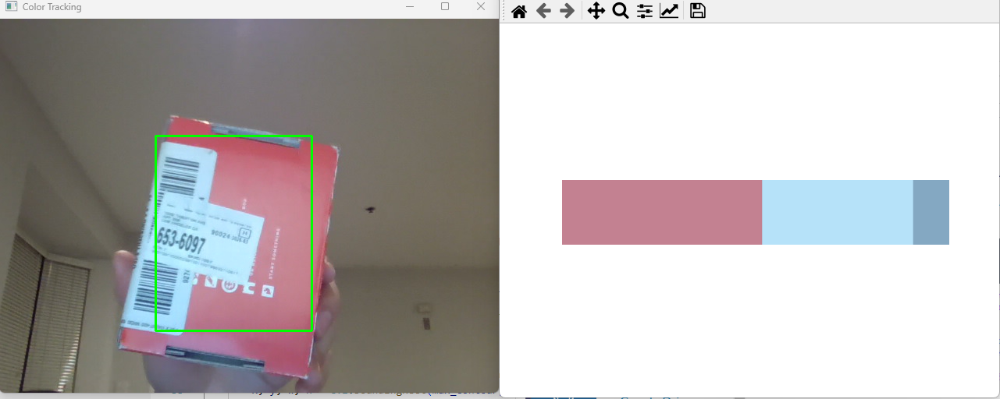
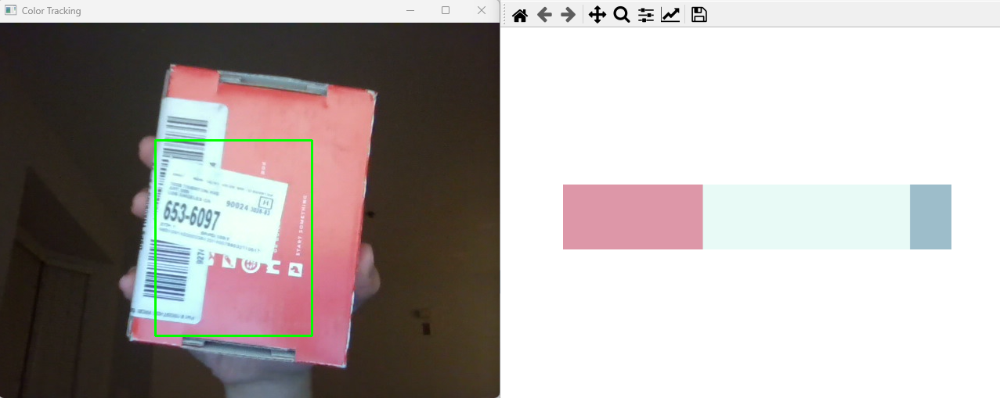
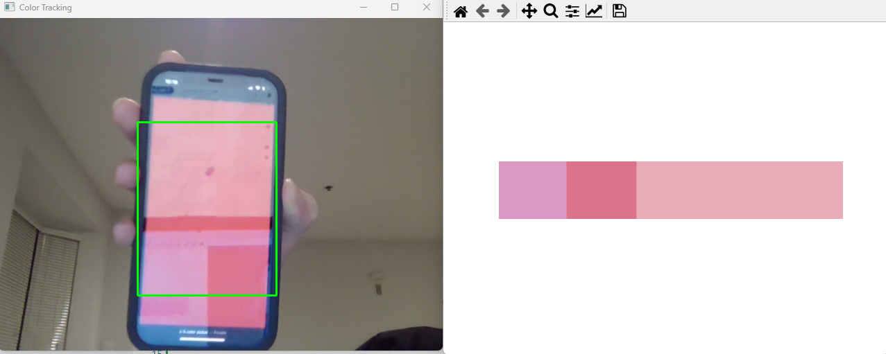
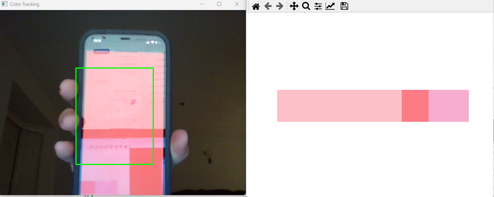

# 180DA-WarmUp

# Task 4
1. HSV is typically used over RGB in object tracking due to its ability to easily isolate specific color ranges in different lighting conditions (as HSV controls hue, saturation, and brightness/value) where as RGB only gives color information. The threshold range is typically dependent on lighting and camera conditions, however for HSV it is generally pretty tight with the hue varying by roughly 10 degrees, but with saturation and value being within a wide range of variation from 50-255.

2. When changing the lighting condition on an object, it becomes much more difficult for our program to track the object due to our static threshold range for the color mask that we have set. You can see in the image that the program has difficulty creating the correct bounding box once the lights has been turned off in the room.

3. The program can also pick up colors on our phone screens however, when the phone brightness is adjusted to be darker or brighter, then the program once again begins to have difficulties due to the threshold range.

4. Based on purely the tests done in the below images, it does not seem like the phone or object used provide any more robustness or resilience to brightness. Both demonstrate slight hue changes when exposed to different lighting conditions.

